<!doctype html>
<html lang="en">
<head>
<meta charset="utf-8">
<meta name="viewport" content="width=device-width, initial-scale=1">
<title>Home Glass — Your whole home, in one app</title>
<meta name="description" content="Home Glass brings your whole smart home to Apple Vision Pro, iPhone, iPad, Mac and Apple TV. Support, help and privacy.">
<link rel="icon" href="assets/icon.png">

</head>
<body>
<header class="wrap top">
<a class="brand" href="./">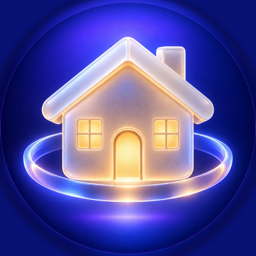Home Glass</a>
<nav><a href="#connections">Connections</a><a href="#help">Help</a><a href="#support">Support</a><a href="privacy">Privacy</a></nav>
</header>
<main>

<h1>Your whole home, in one app.</h1>

Lights, cameras, climate, TVs, speakers, locks and appliances, from every brand, together on Apple Vision Pro, iPhone, iPad, Mac and Apple TV.

Apple Vision ProiPhoneiPadMacApple TViPhone Duo ready

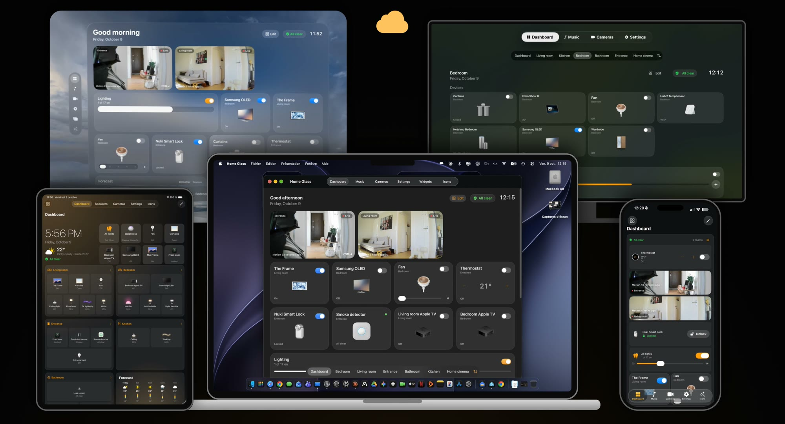

<section>

<h2>One app on every Apple screen</h2>

The same home everywhere, made for each device. Your rooms, names, icons and groups follow you through iCloud.

<h3 class="device">Mac</h3>

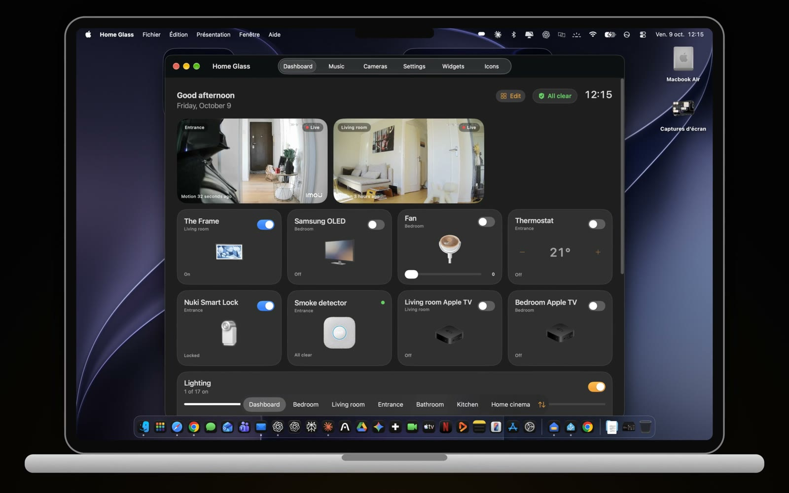

<h3 class="device">Apple Vision Pro</h3>

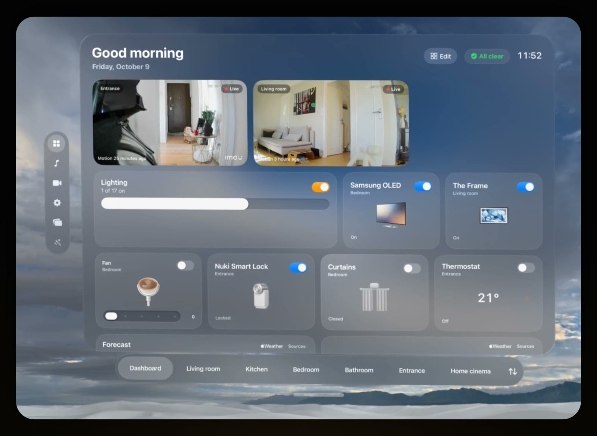

<h3 class="device">iPhone and iPad</h3>

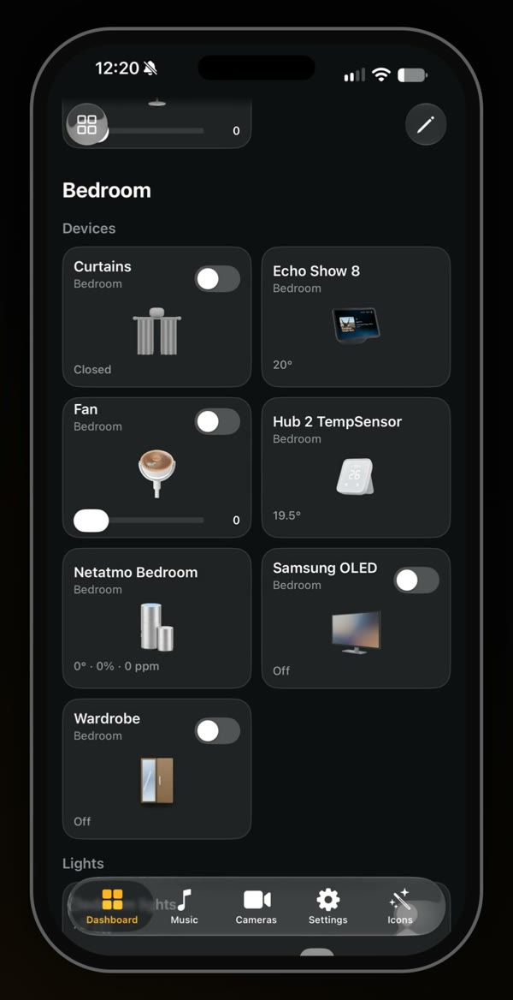

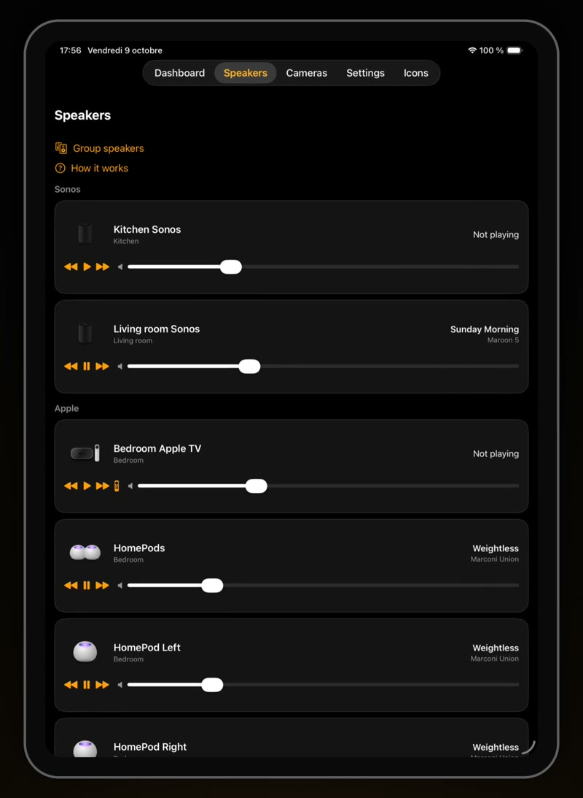

</section>
<section>

<h2>Ready for iPhone Duo</h2>

Closed, the essentials on the cover screen. Open, every room across both screens.

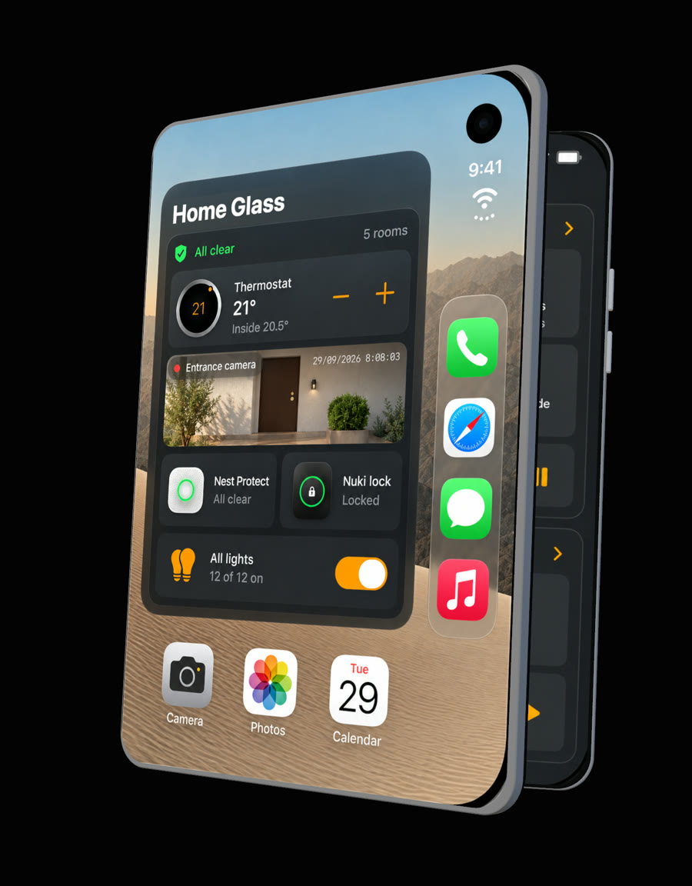

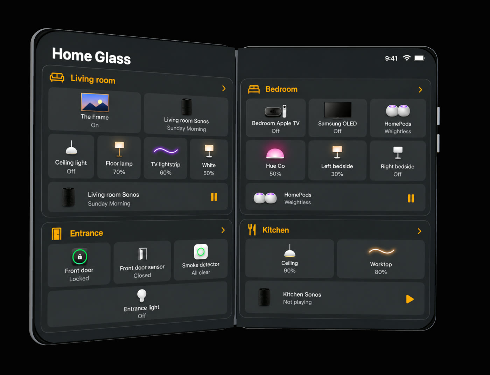

</section>
<section>

<h2>And widgets, everywhere</h2>

Set into your walls on Apple Vision Pro, on the Home Screen of your iPhone and iPad, and on your Mac desktop.

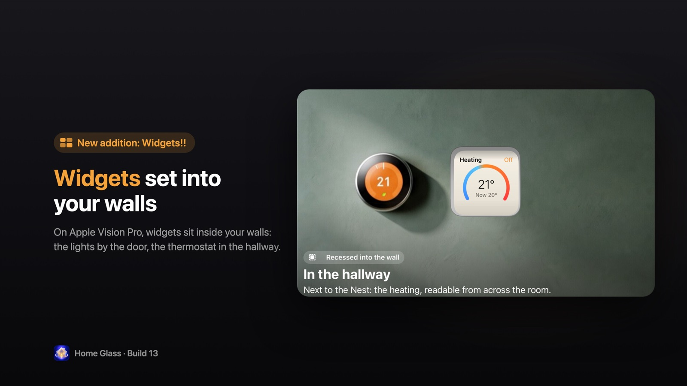

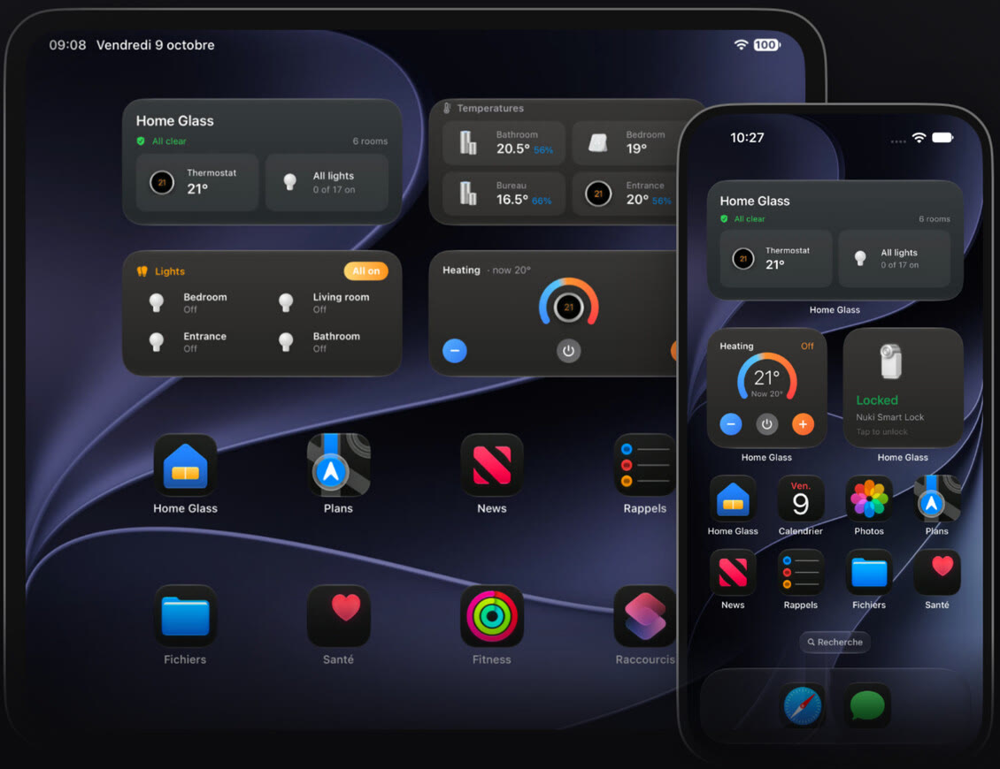

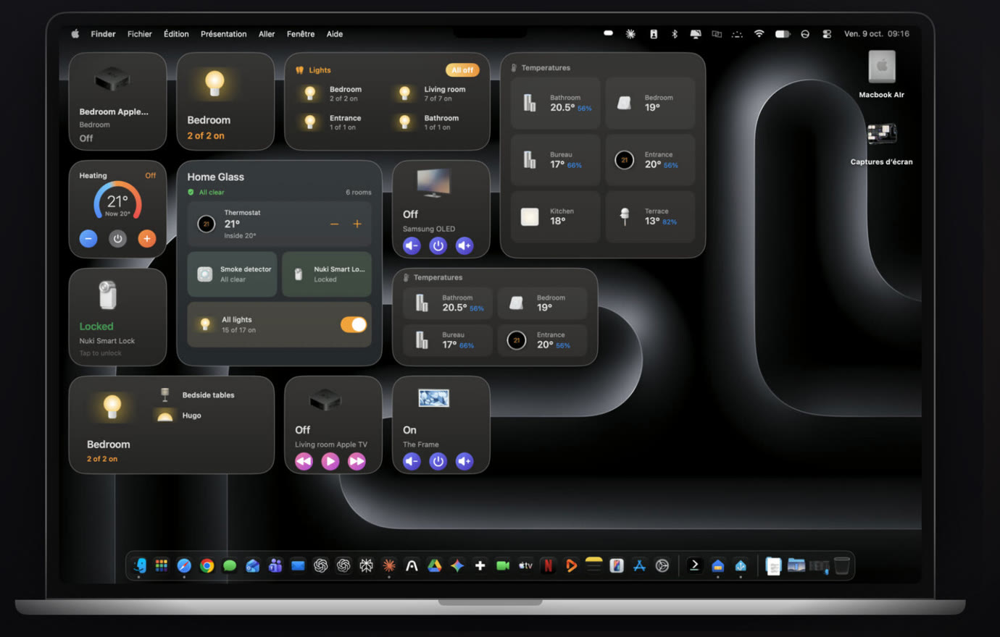

<h3>Your home at a glance</h3>
Cameras, climate with the forecast, all your lights, TVs, weather and your devices' batteries, then every room.

<h3>Speakers</h3>
Sonos, HomePod, Apple TV and Echo: what's playing, play and pause, volume, and Sonos groups.

<h3>Icon Studio</h3>
About 1,000 real products drawn in one style, recognised automatically from your devices' names and models.

<h3>Made yours</h3>
Reorder tiles and sections, move a device to another room, rename anything, hide what you never use, group lights.

</section>
<section id="connections">

<h2>Works with what you already have</h2>

Home Glass talks to your devices directly from your iPhone, iPad, Mac or Vision Pro. A device that reaches it two ways appears only once.

Apple HomeMatterHome AssistantPhilips HueSamsung SmartThingsSwitchBotTuya · Smart Life

Coming in the next update:

ShellyGoveeIKEA DIRIGERALG ThinQNukiSomfy TaHomaHome Connect (Bosch, Siemens, Neff)

</section>
<section id="help">

<h2>Help</h2>

Step-by-step guides for every connection are in the app: Settings › Help &amp; Support. The questions people ask most:

Apple Home or Home Assistant: which should I use?

Apple Home is the easiest: everything already in Apple's Home app works right away, Matter devices included, with nothing to keep running. Home Assistant is best if you already run it on a server that's always on: the most devices, live cameras and every detail. You can use both: duplicates are merged.

How do I connect Home Assistant?

In Settings › Connections › Home Assistant, open the connection guide. Home Glass finds your server on your network. In Home Assistant, click your name, open the Security tab, create a long-lived access token, and paste it in Home Glass. The token stays in your device's Keychain. On Apple TV, send the connection from your iPhone instead of typing it with the remote.

Can I try it without a smart home?

Yes. On the welcome screen, choose "Try the demo": a complete home with lights, TVs, speakers, cameras, a thermostat and a lock.

How do I add widgets?

On iPhone and iPad, touch and hold the Home Screen, tap Edit, then Add Widget, and choose Home Glass. On Mac, right-click the desktop and choose Edit Widgets. On Apple Vision Pro, look at a wall, open the Widgets app, choose a Home Glass widget and place it. In Settings, Home Glass shows every step.

What's free, and what does Pro include?

Free: your Home page with everything at a glance, your first 2 rooms (you choose which), 2 speakers and 2 wall widgets to try. Pro, one purchase with no subscription that unlocks every platform: every room and speaker, every widget, live cameras, and illustrations of your exact devices. You can restore it from Settings.

A device is missing or shown wrong.

Write to us with its brand and model, and how it reaches Home Glass (Apple Home, Home Assistant…). Settings › Support › Contact the developer fills in your version and device for you.

</section>
<section id="support">

<h2>Support</h2>

Questions, bugs or ideas? I read every message and answer within two days.

<a class="button" href="mailto:charlesmillet@me.com?subject=Home%20Glass">charlesmillet@me.com</a>

</section>
</main>
<footer class="wrap">Home Glass, by Charles Millet · <a href="privacy">Privacy Policy</a> No account, no tracking, no servers: Home Glass talks directly to your home. Apple, Apple Vision Pro, iPhone, iPad, Mac and Apple TV are trademarks of Apple Inc. Other brands belong to their owners; Home Glass isn't affiliated with them.</footer>
</body>
</html>
